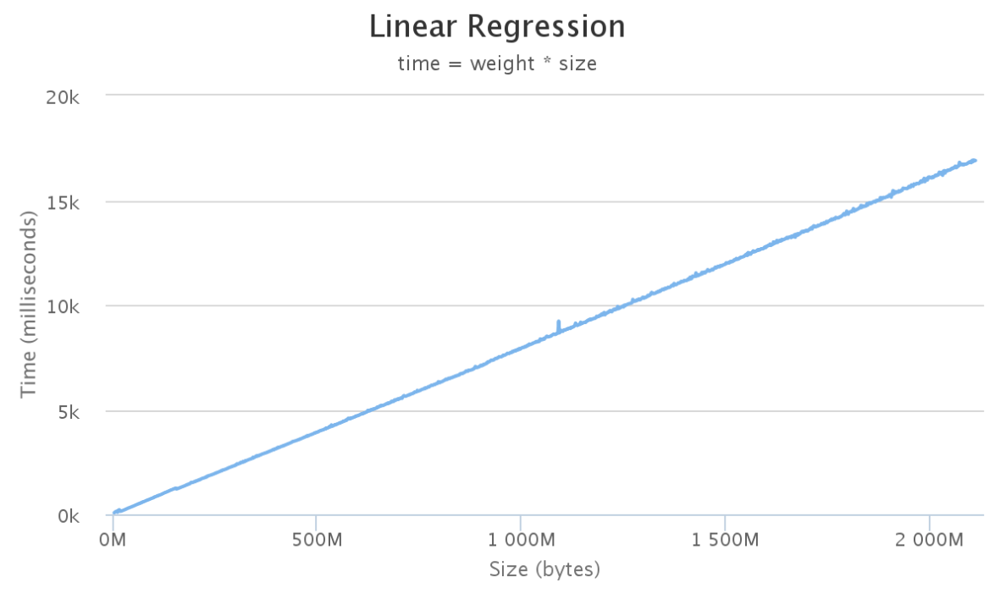

= What's it
:toc: manual
:toc-placement: preamble

This is document for Deserialization Weight Calculation.

== Deserialization Weight Calculation

In java deserialization is pretty expensive, we can see it's 100% processor occupation, the size of content to deserialize is critical for performance, the bigger of size, the larger of time.

NOTE: In Linux System, command `cat /proc/cpuinfo | grep "processor" | wc -l` can get the number of total processor.

Each **time** have a reference **size**, (size 1, time 1),(size 2, time 2), ..., (size n, time n). In statistics, time and size are in a linear regression approach:

[source,java]
----
time = weight * size
----

* time - a integer variable, represent how many milliseconds took in deserializing a specific size content.
* size - a integer variable, represent how many bytes need to be deserialized.
* weight - a integer constant, represent the weight of linear regression.

NOTE: if we have know the linear regression weight, each time for a deserialization size, it's easy to calculate the deserialization time.

== What's Deserialization Weight Calculation

The Deserialization Weight Calculation is a tool used to calculate the linear regression weight by specify a size.

[source,java]
----
$ java -jar sizing-utils.jar deserialization 100
----

The above command run will output

[source,java]
----
Prepare deserialization data
100% finished
Insert 409600 rows, size 100MB, spend 60056 milliseconds
Collect deserialization (size, time) tuples
100% finished
Collect 512 tuples, spend 226338 milliseconds, garbage collection spend 23377, garbage collection count 1209
Calculating linear regression weight
      Weight: 0.0000073714
----

the last line is output the linear regression weight.

== How to run

In addition to specify a deserialization size, there are other 4 optional options:

[source,java]
----
$ java -jar sizing-utils.jar deserialization <size> <counts> <ratio> <refresh> <dumptuples> <exportCSV>
----

|===
|Option Name |Description |Optional |Default

|size
|The size in MB to be deserialized, a integer, eg, 100, 200, etc
|false
|

|counts
|The number of tuples(size, time) to be collected, a integer which should be equals 1 << X, eg, 256, 512, 1024, 2048, etc
|true
|512

|ratio
|a float, less than 1 and larger than 0, the ratio for regression weight
|true
|0.75

|refresh
|whether to refresh tuples
|true
|false

|dumptuples
|whether to dump tuples
|true
|false

|exportCSV
|whether export result to a csv file
|true
|false
|===

NOTE: if counts and size are larger, the deserialization will run long time(several hours).

=== Sample of tuples and weight

* link:etc/samples/deserialization-1-1024[deserialization-1-1024] - Collect 1024 tuples against 1 MB deserialization data and calculate weight
* link:etc/samples/deserialization-100-1024[deserialization-100-1024] - Collect 1024 tuples against 100 MB deserialization data and calculate weight
* link:etc/samples/deserialization-2048-1024[deserialization-2048-1024] - Collect 1024 tuples against 2 GB deserialization data and calculate weight

== Conclusion

Deserialization time and size in a linear relation, the regression weight is around 0.0000075, in other words

`time = 0.0000075 * size`

